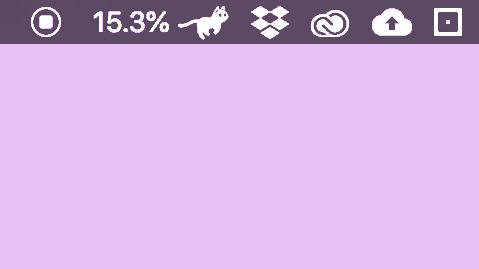

# menubar_runcat

<!-- # Short Description -->

A cute Running Cat animation on your MacBook menubar.

This project is a reduced version of RunCat.app (App Store).

<!-- # Badges -->

# Tags

`Swift` `Cat` `menubar`

# Demo

# Contributors

- [Kyome22](https://github.com/Kyome22)

<!-- CREATED_BY_LEADYOU_README_GENERATOR -->