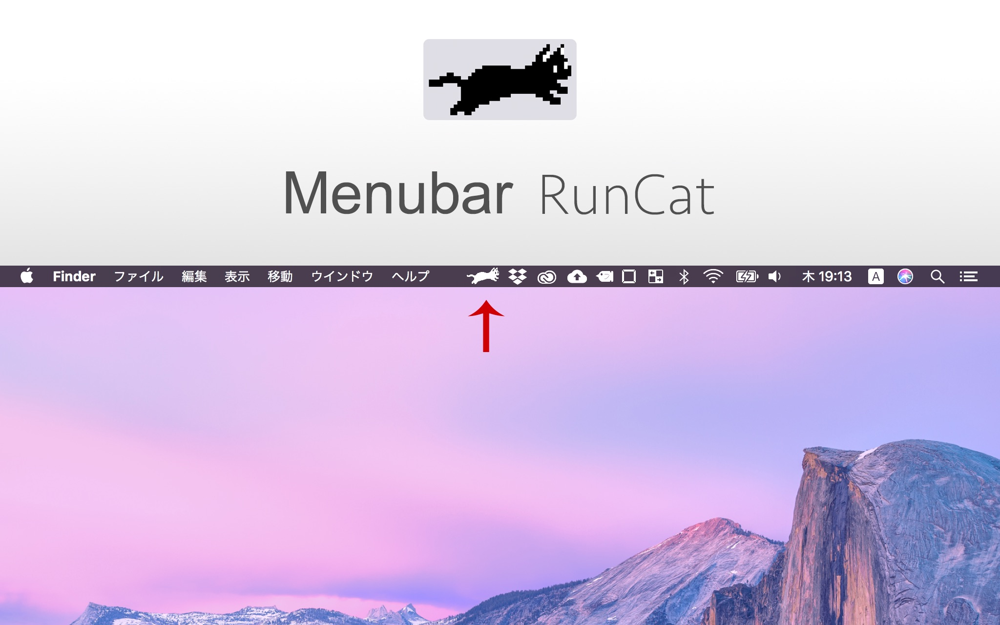

# Menubar RunCat
A cute Running Cat animation on your MacBook menubar. Enjoy.  
あなたのMacBookのメニューバーで可愛い猫のアニメーションを実行できます．楽しんで♪

[Download ⬇️](https://www.dropbox.com/sh/mhu4xayr56l9hq4/AAAL8LO1pG9rVpC3pQ1bMazOa?dl=0)

***
If you set RunCat to accessibility in [Security & Privacy] of [System Preferences], the cat become able to run by key input.  
システム環境設定のセキュリティとプライバシーでアクセシビリティに設定すると，キー入力でもアニメーションするようになります．

